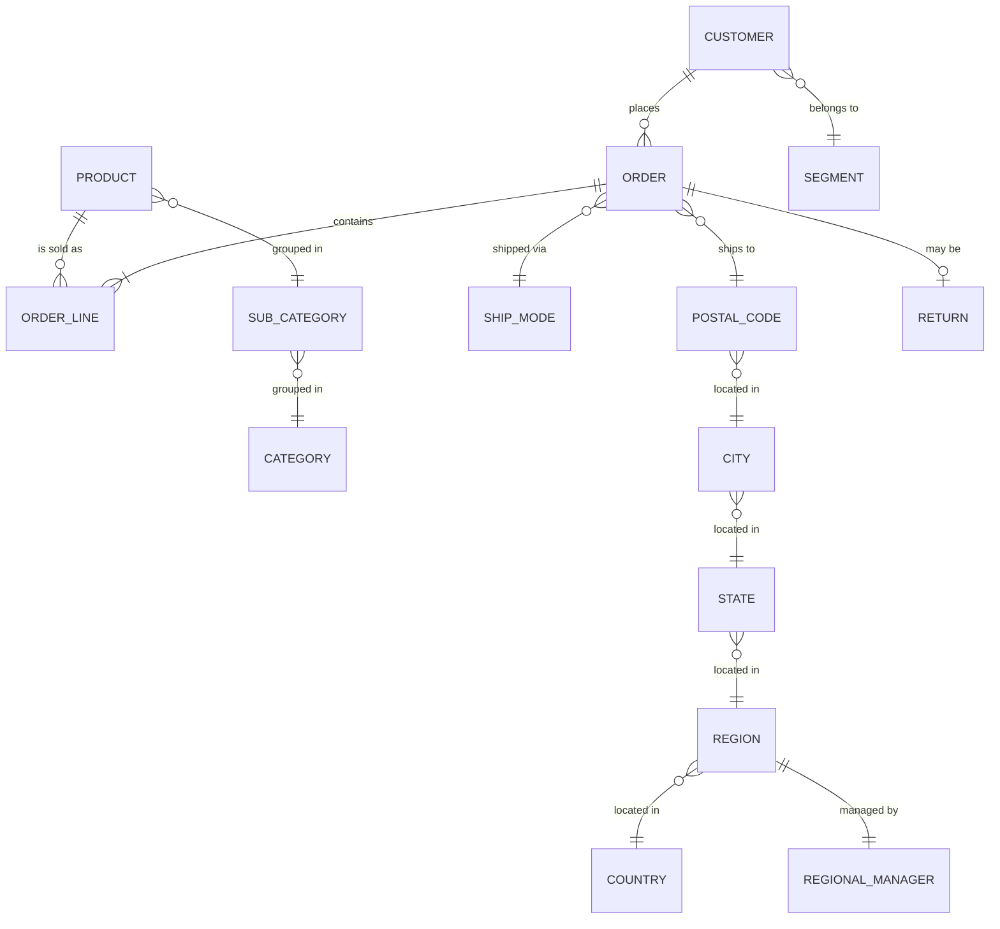
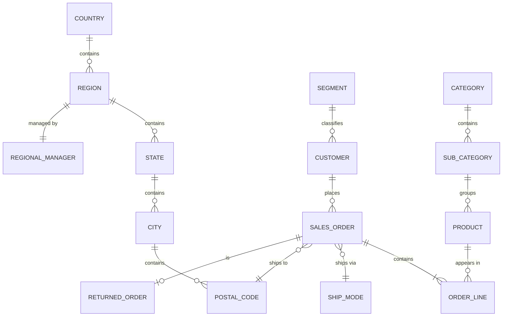
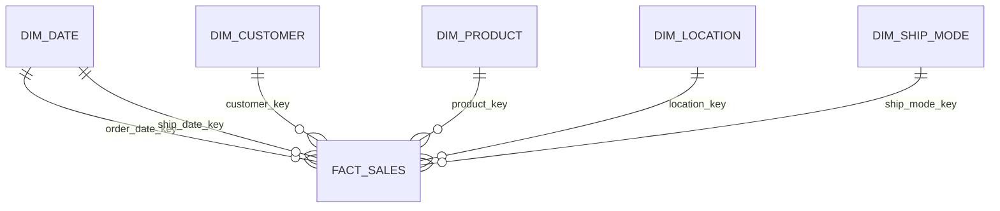

# Superstore Data Models

Design deliverable for the three source files:

| File | Grain | Rows | Notes |
|---|---|---|---|
| `clean_orders.csv` | one row per **order line** (shipment line) | 9,994 | flat / denormalized, 21 columns |
| `returns_clean.csv` | one row per **returned order** | 296 | order-level flag |
| `people_clean.csv` | one row per **region** | 4 | regional manager lookup |

Generic (DBMS-agnostic) SQL types are used throughout: `INTEGER`, `SMALLINT`, `VARCHAR(n)`, `CHAR(n)`, `NUMERIC(p,s)`, `DATE`, `BOOLEAN`.

---

## 0. Profiling evidence (functional dependencies)

Before modelling, the source was profiled. Functional dependency `A -> B` means every value of `A`
maps to exactly one value of `B` (0 = holds, >0 = violations).

| Determinant `A` | Dependent `B` | Violations | Holds? |
|---|---|---|---|
| `order_id` | `customer_id`, `customer_name`, `segment` | 0 | yes |
| `order_id` | `order_date`, `ship_date`, `ship_mode` | 0 | yes |
| `order_id` | `city`, `state`, `postal_code`, `region` | 0 | yes |
| `customer_id` | `customer_name`, `segment` | 0 | yes |
| `product_id` | `category`, `sub_category` | 0 | yes |
| `product_id` | `product_name` | 32 | **no** (same id, several names) |
| `sub_category` | `category` | 0 | yes |
| `state` | `region` | 0 | yes |
| `postal_code` | `state`, `region` | 0 | yes |
| `postal_code` | `city` | 1 | no (92024 -> San Diego / Encinitas) |
| `city` | `state`, `postal_code` | 57 / 68 | **no** (city names repeat across states) |
| `region` | `state` | 4 | no (a region has many states) |

**Grain problem:** `(order_id, product_id)` is **not** unique (8 duplicate pairs), so the order **line**
needs its own surrogate key (`row_id` / `order_line_id`).

**Data-quality issues carried into the design notes:** 32 `product_id`s map to more than one
`product_name`; one `postal_code` maps to two `city` names; all postal codes are `CHAR(5)`; the only
country present is *United States*.

---

## 1. Conceptual model

Purely business-facing: **entities + relationships + cardinality only** — no attributes, no keys, no types.

### 1.1 Diagram

### 1.2 Entities and relationships

| # | Entity | Business meaning |
|---|---|---|
| 1 | **Customer** | A buyer with a name and a market segment. |
| 2 | **Segment** | Consumer / Corporate / Home Office. |
| 3 | **Order** | A single sales order with order date, ship date and ship mode. |
| 4 | **Order Line** | One product (with quantity, sales, discount, profit) on an order. |
| 5 | **Product** | A sellable item. |
| 6 | **Sub-category** | Grouping of products (17 values). |
| 7 | **Category** | Top grouping (Furniture / Office Supplies / Technology). |
| 8 | **Ship Mode** | Standard / Second / First Class / Same Day. |
| 9 | **Return** | Marks an order (and all of its lines) as returned. |
| 10 | **Postal Code / City / State / Region / Country** | Geographic hierarchy of the ship-to address. |
| 11 | **Regional Manager** | The person responsible for a region (from `people_clean.csv`). |

| Relationship | Cardinality | Business rule |
|---|---|---|
| Customer — Order | 1 : N (a customer may place 0..N orders) | Every order belongs to exactly one customer. |
| Order — Order Line | 1 : N (mandatory, N ≥ 1) | An order must contain at least one line. |
| Product — Order Line | 1 : N | A line is for exactly one product; a product appears on many lines. |
| Product — Sub-category | N : 1 | Every product has exactly one sub-category. |
| Sub-category — Category | N : 1 | Every sub-category belongs to exactly one category. |
| Order — Ship Mode | N : 1 | An order uses exactly one ship mode. |
| Order — Postal Code | N : 1 | An order ships to exactly one postal code. |
| Postal Code — City — State — Region — Country | N : 1 each | Strict geographic hierarchy. |
| Region — Regional Manager | 1 : 1 | A region has exactly one regional manager. |
| Customer — Segment | N : 1 | A customer belongs to exactly one segment. |
| Order — Return | 1 : 0..1 | An order is either returned or not. |

---

## 2. Inmon — 3NF logical model

Third-normal-form enterprise warehouse: every table holds one subject, non-key attributes depend on
*the key, the whole key and nothing but the key*. Surrogate keys (`INTEGER`) are introduced for most
entities; natural/source keys are kept and constrained `UNIQUE`.

### 2.1 Diagram

### 2.2 Reference (lookup) tables

**country**
| Attribute | Key | SQL type | Null | Notes |
|---|---|---|---|---|
| country_id | **PK** | INTEGER | no | surrogate |
| country_name | | VARCHAR(60) | no | `UNIQUE` |

**region**
| Attribute | Key | SQL type | Null | Notes |
|---|---|---|---|---|
| region_id | **PK** | INTEGER | no | surrogate |
| region_name | | VARCHAR(20) | no | `UNIQUE` (West/East/Central/South) |
| country_id | **FK -> country** | INTEGER | no | |

**state**
| Attribute | Key | SQL type | Null | Notes |
|---|---|---|---|---|
| state_id | **PK** | INTEGER | no | surrogate |
| state_name | | VARCHAR(50) | no | `UNIQUE` |
| region_id | **FK -> region** | INTEGER | no | `state -> region` |

**city**
| Attribute | Key | SQL type | Null | Notes |
|---|---|---|---|---|
| city_id | **PK** | INTEGER | no | surrogate |
| city_name | | VARCHAR(60) | no | |
| state_id | **FK -> state** | INTEGER | no | `UNIQUE(city_name, state_id)` — city names repeat across states |

**postal_code**
| Attribute | Key | SQL type | Null | Notes |
|---|---|---|---|---|
| postal_code | **PK** | CHAR(5) | no | natural key, zero-padded |
| city_id | **FK -> city** | INTEGER | no | |

**regional_manager** *(from `people_clean.csv`)*
| Attribute | Key | SQL type | Null | Notes |
|---|---|---|---|---|
| manager_id | **PK** | INTEGER | no | surrogate |
| manager_name | | VARCHAR(60) | no | |
| region_id | **FK -> region** | INTEGER | no | `UNIQUE` — enforces the 1:1 with region |

**segment**
| Attribute | Key | SQL type | Null | Notes |
|---|---|---|---|---|
| segment_id | **PK** | SMALLINT | no | |
| segment_name | | VARCHAR(20) | no | `UNIQUE` |

**ship_mode**
| Attribute | Key | SQL type | Null | Notes |
|---|---|---|---|---|
| ship_mode_id | **PK** | SMALLINT | no | |
| ship_mode_name | | VARCHAR(20) | no | `UNIQUE` |

**category**
| Attribute | Key | SQL type | Null | Notes |
|---|---|---|---|---|
| category_id | **PK** | SMALLINT | no | |
| category_name | | VARCHAR(30) | no | `UNIQUE` |

**sub_category**
| Attribute | Key | SQL type | Null | Notes |
|---|---|---|---|---|
| sub_category_id | **PK** | SMALLINT | no | |
| sub_category_name | | VARCHAR(30) | no | `UNIQUE` |
| category_id | **FK -> category** | SMALLINT | no | `sub_category -> category` |

**customer**
| Attribute | Key | SQL type | Null | Notes |
|---|---|---|---|---|
| customer_id | **PK** | VARCHAR(10) | no | natural key (e.g. `CG-12520`) |
| customer_name | | VARCHAR(60) | no | |
| segment_id | **FK -> segment** | SMALLINT | no | |

**product**
| Attribute | Key | SQL type | Null | Notes |
|---|---|---|---|---|
| product_id | **PK** | VARCHAR(20) | no | natural key (e.g. `FUR-BO-10001798`) |
| product_name | | VARCHAR(150) | no | 32 ids carry >1 name (DQ note) |
| sub_category_id | **FK -> sub_category** | SMALLINT | no | |

### 2.3 Transaction tables

**sales_order** *(entity `Order`; `order` is a reserved word)*
| Attribute | Key | SQL type | Null | Notes |
|---|---|---|---|---|
| order_id | **PK** | VARCHAR(20) | no | natural key (e.g. `CA-2017-152156`) |
| customer_id | **FK -> customer** | VARCHAR(10) | no | |
| order_date | | DATE | no | |
| ship_date | | DATE | no | |
| ship_mode_id | **FK -> ship_mode** | SMALLINT | no | |
| postal_code | **FK -> postal_code** | CHAR(5) | no | ship-to location |

**order_line** *(the warehouse fact at transactional grain)*
| Attribute | Key | SQL type | Null | Notes |
|---|---|---|---|---|
| order_line_id | **PK** | INTEGER | no | surrogate; = source `row_id`. Needed because `(order_id, product_id)` is **not** unique |
| order_id | **FK -> sales_order** | VARCHAR(20) | no | |
| product_id | **FK -> product** | VARCHAR(20) | no | |
| quantity | | SMALLINT | no | `CHECK (quantity > 0)` |
| sales | | NUMERIC(12,4) | no | |
| discount | | NUMERIC(5,4) | no | 0.0000 – 0.8000 |
| profit | | NUMERIC(12,4) | no | can be negative |

**returned_order** *(entity `Return`; from `returns_clean.csv`)*
| Attribute | Key | SQL type | Null | Notes |
|---|---|---|---|---|
| order_id | **PK + FK -> sales_order** | VARCHAR(20) | no | 1:1 with `sales_order` |
| returned | | BOOLEAN | no | |

### 2.4 Cardinality summary (3NF)

- `country 1—N region`, `region 1—N state`, `state 1—N city`, `city 1—N postal_code`
- `region 1—1 regional_manager`
- `segment 1—N customer`
- `customer 1—N sales_order`
- `sales_order 1—N order_line` (mandatory), `sales_order 1—0..1 returned_order`
- `ship_mode 1—N sales_order`, `postal_code 1—N sales_order`
- `category 1—N sub_category 1—N product 1—N order_line`

---

## 3. Kimball — dimensional design

Denormalized **star schema**: business-friendly dimensions around one central fact at the declared grain.

### 3.1 Declaration

- **Business process:** sales order fulfillment (and return tracking).
- **Grain (one fact row =):** one **order line** — a single product on a single order.
- **Dimensions:** Date (role-playing: order & ship), Customer, Product, Location (Geography), Ship Mode.
- **Measures:** sales, quantity, discount, profit.
- **Degenerate dimensions:** order_id, returned_flag.

### 3.2 Bus matrix

| Business process | Date | Customer | Product | Location | Ship Mode |
|---|:--:|:--:|:--:|:--:|:--:|
| Sales order line | ✔ (order + ship) | ✔ | ✔ | ✔ | ✔ |
| Returns | ✔ | ✔ | ✔ | ✔ | |

### 3.3 Diagram

### 3.4 Dimensions

**dim_date** (role-plays as order date and ship date)
| Attribute | Key | SQL type | Null | Notes |
|---|---|---|---|---|
| date_key | **PK** | INTEGER | no | smart key `YYYYMMDD` |
| full_date | | DATE | no | |
| year | | SMALLINT | no | |
| quarter | | SMALLINT | no | |
| month | | SMALLINT | no | |
| month_name | | VARCHAR(10) | no | |
| day_of_month | | SMALLINT | no | |
| day_of_week | | SMALLINT | no | |
| day_name | | VARCHAR(10) | no | |
| is_weekend | | BOOLEAN | no | |

**dim_customer**
| Attribute | Key | SQL type | Null | Notes |
|---|---|---|---|---|
| customer_key | **PK** | INTEGER | no | surrogate |
| customer_id | | VARCHAR(10) | no | natural key (bus key) |
| customer_name | | VARCHAR(60) | no | |
| segment | | VARCHAR(20) | no | flattened from `segment` |

**dim_product**
| Attribute | Key | SQL type | Null | Notes |
|---|---|---|---|---|
| product_key | **PK** | INTEGER | no | surrogate |
| product_id | | VARCHAR(20) | no | natural key (bus key) |
| product_name | | VARCHAR(150) | no | |
| category | | VARCHAR(30) | no | flattened |
| sub_category | | VARCHAR(30) | no | flattened |

**dim_location** (flattened geography incl. manager)
| Attribute | Key | SQL type | Null | Notes |
|---|---|---|---|---|
| location_key | **PK** | INTEGER | no | surrogate |
| postal_code | | CHAR(5) | no | |
| city | | VARCHAR(60) | no | |
| state | | VARCHAR(50) | no | |
| region | | VARCHAR(20) | no | |
| country | | VARCHAR(60) | no | |
| regional_manager | | VARCHAR(60) | no | from `people_clean.csv` |

**dim_ship_mode** (mini-dimension)
| Attribute | Key | SQL type | Null | Notes |
|---|---|---|---|---|
| ship_mode_key | **PK** | SMALLINT | no | |
| ship_mode_name | | VARCHAR(20) | no | |

### 3.5 Fact table

**fact_sales**
| Attribute | Key | SQL type | Null | Notes |
|---|---|---|---|---|
| sales_key | **PK** | BIGINT | no | surrogate line key |
| order_date_key | **FK -> dim_date** | INTEGER | no | |
| ship_date_key | **FK -> dim_date** | INTEGER | no | role-playing date |
| customer_key | **FK -> dim_customer** | INTEGER | no | |
| product_key | **FK -> dim_product** | INTEGER | no | |
| location_key | **FK -> dim_location** | INTEGER | no | |
| ship_mode_key | **FK -> dim_ship_mode** | SMALLINT | no | |
| order_id | | VARCHAR(20) | no | **degenerate dimension** |
| returned_flag | | BOOLEAN | no | **degenerate dimension** (from returns) |
| sales | | NUMERIC(12,4) | no | measure |
| quantity | | SMALLINT | no | measure |
| discount | | NUMERIC(5,4) | no | measure |
| profit | | NUMERIC(12,4) | no | measure (signed) |

### 3.6 Cardinality summary (Kimball)

- Each dimension is `1 — N` to `fact_sales` (one dimension row referenced by many fact rows).
- `dim_date` participates **twice** (order date and ship date) — a role-playing dimension.
- Fact grain = order line; `order_id` repeats across the lines of one order (degenerate dimension).
- Optional companion **`fact_returns`** at the *order* grain (order_date_key, customer_key,
  product_key, location_key, degenerate `order_id`, `return_count = 1`) supports the returns bus process.

---

## 4. Inmon (3NF) vs. Kimball — how the same data is modelled

| Aspect | Inmon (section 2) | Kimball (section 3) |
|---|---|---|
| Structure | normalized, many tables | star: 5 dims + 1 fact |
| Keys | surrogate + natural keys, snowflaked lookups | surrogate keys only on dims, natural keys as attributes |
| Geography | 5-level hierarchy (country→region→state→city→postal) | flattened into `dim_location` |
| Product grouping | `product → sub_category → category` | flattened into `dim_product` |
| Return | separate 1:1 `returned_order` table | `returned_flag` degenerate on the fact |
| Optimization | integrity / non-redundancy | query simplicity (fewer joins) |
| Answers Q1–Q3 | more joins | fewer joins |
